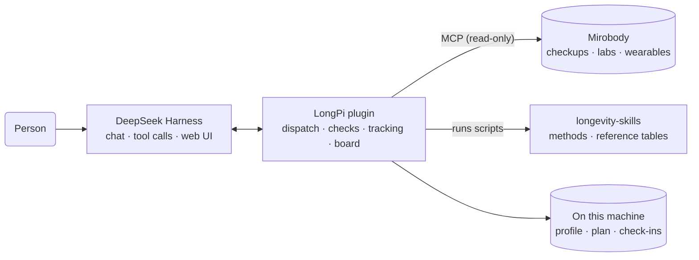

# LongPi

**English** · **[中文](README.zh.md)**

LongPi is a personal longevity assistant for [DeepSeek Harness](https://github.com/deepseek-ai/deepseek-harness). It connects checkup reports, lab results and wearable data with more than 170 aging-research methods, each reproduced from its paper. From the results a person already has, it computes biological age, 10-year cardiovascular risk and other personal measures. Once the person sets an intervention plan, it tracks adherence, uses within-person biological variation to tell a real change from normal fluctuation, and estimates what reaching a goal would change. Every result traces back to its original paper, and every method states its limits.

- **Biological age and disease risk**: published models such as phenotypic age (Levine) and China-PAR, with a trend across every checkup.
- **Plan tracking**: the person's own intervention plan, with adherence from wearables, the medication log and check-ins.
- **Effect review**: reference change values separate real change from noise, next to the average effect seen in trials.
- **Evidence lookup**: what the collected papers say about drugs, supplements, diets and genes, grouped by human, animal and cell studies.

## Installation

In a macOS or Linux terminal, run:

```bash
curl -fsSL https://raw.githubusercontent.com/zwbao/dsh-plugin-longpi/main/install.sh | bash
```

The installer adds the DeepSeek Harness CLI if it is missing, downloads the skill library, creates a Python environment with the Mirobody terminology engine under `~/longpi`, and installs and configures the plugin in DeepSeek Harness. It needs Node.js 22.19+, Python 3.12+ and git, and running it again updates everything.

Health records come from [Mirobody](https://github.com/thetahealth/mirobody). With an existing Mirobody, add `--mcp-url` and its personal MCP address. Without one, add `--with-mirobody` to deploy a local instance with demo data through Docker:

```bash
curl -fsSL https://raw.githubusercontent.com/zwbao/dsh-plugin-longpi/main/install.sh | bash -s -- --with-mirobody
```

See `install.sh --help` for other options and [docs/install.md](docs/install.md) for a step-by-step installation.

## Usage

Start DeepSeek Harness with `dsh web`. On first launch, enter a DeepSeek API key and pick a workspace. Then:

1. **Build the profile**: age, sex, and the six facts the cardiovascular model needs (smoking, diabetes, blood-pressure medicine in the last two weeks, northern or southern China, urban or rural, early cardiovascular disease in the family). Fill them in under 记录、方法和档案 at the bottom of the health board, or state them in the chat.
2. **See the results**: open the 健康看板 view from the tabs at the top of the session. When the record holds a checkup with all nine blood markers on one day, the board computes phenotypic age for every such checkup and the 10-year cardiovascular risk.
3. **Set a plan**: describe the plan in the chat or upload one from a doctor or longevity coach. LongPi reads it back, saves it after confirmation, and shows a timeline, retest dates and goal estimates on the board.
4. **Track and review**: wearable data counts toward adherence automatically; other items are checked in from the chat or the board. Once a retest reaches Mirobody, the board gives a verdict (working, within noise, the wrong way, or cannot tell) with its reasons.

Example questions:

| Goal | Example |
| --- | --- |
| See existing results | Which indicators are in my record? |
| Biological age | Compute my phenotypic age from the blood tests in my record |
| Cardiovascular risk | What is my 10-year cardiovascular risk? |
| Save a plan | Save my plan: brisk walking 8,000 steps a day, strength training three times a week, asleep by 11 pm |
| Review the plan | Is my plan working? Which parts cannot be judged yet? |
| Model a goal | If fasting glucose drops to 5.0, how would my phenotypic age change? |
| Look up evidence | What do the collected papers say about NMN and metformin? |

Type `/longpi` in the chat to see the status: skill library version, Mirobody connection and profile.

## How it works



Three parts work together:

- **DeepSeek Harness** hosts the conversation, tool calls and web interface; LongPi registers its tools, commands and health board as a plugin.
- **Mirobody** holds the health record and maps lab names from any source to LOINC codes and units to UCUM. LongPi reads the record through its MCP endpoint, read-only, and runs the terminology engine locally.
- **[longevity-skills](https://github.com/zwbao/longevity-skills)** is the method library. Each method comes from one published paper and carries a machine-readable input manifest (LOINC codes, units, plausible ranges), a script that reproduces the paper's formula, and tests whose expected values are numbers printed in the paper. The library is updated weekly with new papers.

Key mechanisms:

- **Dispatch**: a question is matched to intents, then methods are ranked by the tests already in the record. Methods that can run now come first; the others list what they still need.
- **Input checks**: values pass as recorded. The plugin converts units declared in the manifest and checks plausible ranges, and refuses a missing or wrong unit before the script runs instead of guessing.
- **Effect review**: a change counts as real only when it exceeds the reference change value (RCV = √2 × 1.96 × √(CVA² + CVI²)), with within-person variation (CVI) taken from journal articles. Adherence, the retest interval and other changes over the same period are weighed as well.
- **Model estimates**: biological age, risk and goal estimates are computed by the method scripts and labelled as model estimates; LongPi does not predict an individual's lifespan.

**Data and privacy**: LongPi uploads nothing. The profile, plans and check-ins stay on this machine in `~/.dsh/longpi`, and the health record stays in the person's own Mirobody. DeepSeek Harness sends conversation content and tool results to the configured model provider. By default it also uploads session logs with its requests; to turn that off, add this to `~/.dsh/profiles/web/cordis.patch.yml`:

```yaml
- id: session-log-deepseek
  config:
    enabled: false
```

## Configuration

The installer writes the configuration. To change it, edit the `dsh-plugin-longpi` block in `~/.dsh/profiles/web/cordis.patch.yml`; changes apply on save. Every key is described in [docs/reference.md](docs/reference.md#configuration).

## Development

```bash
git clone https://github.com/zwbao/dsh-plugin-longpi.git && cd dsh-plugin-longpi
npm ci
npm test          # needs longevity-skills beside this checkout, or LONGEVITY_SKILLS_HOME
npm run preview   # renders the health board with demo data, no DeepSeek Harness needed
```

## Documentation

- [Manual installation](docs/install.md)
- [Reference: configuration, tools, routes and review rules](docs/reference.md)
- [Architecture](docs/architecture.md)
- [Intended use](docs/intended-use.md)
- [Changelog](CHANGELOG.md)

## Disclaimer

LongPi is for personal health management and research reference. It is not a medical device and gives no diagnosis, prescription or dosing advice. All model results are estimates and do not replace professional medical advice; in an emergency, call your local emergency number (120 in China).

## License

[MIT](LICENSE). The bundled `vendor/dsh-plugin-mirobody` is Apache-2.0; for the skill library and its data, see [longevity-skills](https://github.com/zwbao/longevity-skills/blob/main/THIRD_PARTY_NOTICES.md).
