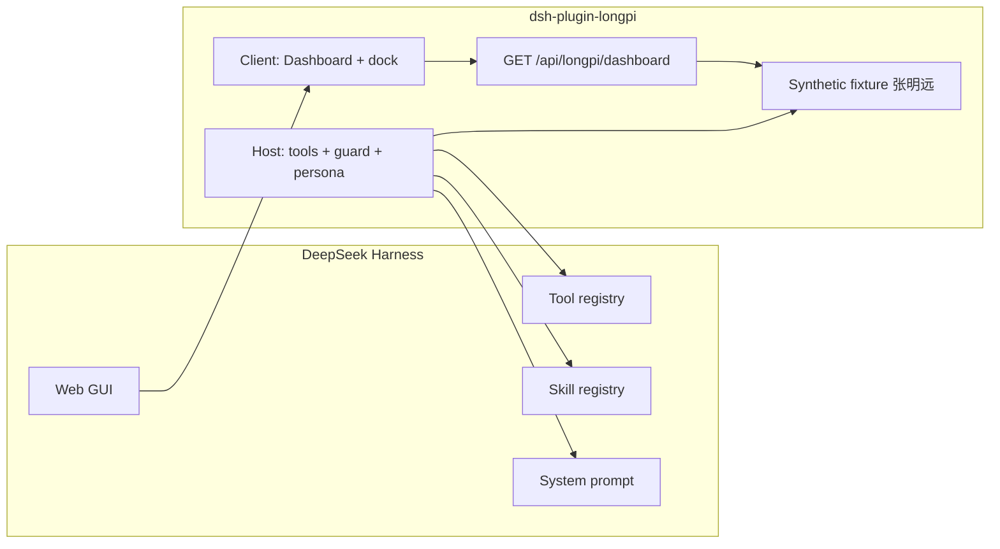

# LongPi for DeepSeek Harness

[](LICENSE)
[](package.json)


**Version 1.0.1.** Production bundle, not an MVP slice.

The **longevity concierge** for [DeepSeek Harness](https://github.com/deepseek-ai/deepseek-harness): a North-Star biological-age dashboard, five phenotype modules, a medically guarded chat, and a launch-day itinerary — as one installable `dsh.bundle`.

[中文](README.zh.md) · [Intended use](docs/intended-use.md) · [Security](SECURITY.md)

<p align="center">
  
</p>

There is no other DSH plugin that owns this surface. Clinical note-drafting lives in [dsh-medseek](https://github.com/Mr-Neutr0n/dsh-medseek). LongPi is the **member-facing longevity OS**: see the number, ask why, take a next step, hand off to a human. Drafts never prescribe.

It is **not a medical device**. Bundled labs belong to the synthetic member 张明远 (demo).

## The claim we can actually defend

Health plugins fail the same way: a number appears on a dashboard and nobody can say where it came from. LongPi's whole pitch is that **every number is either recomputable from the repo or explicitly labelled as a demo input.**

The headline age is computed, not authored:

```sh
npm test   # prints: smoke ok { version: '1.0.1', ... }
```

`test/smoke.mjs` recomputes the published PhenoAge model (Levine 2018) from the nine-marker demo panel and asserts the engine lands on `52.52920526313869` years. Change a coefficient, a unit or the Gompertz back-projection and the test fails. That value, plus the five module weights, produces the composite **45.1** against a chronological **45**.

| Part of the headline | Source | Auditable? |
|---|---|---|
| Biological module age | PhenoAge engine, nine blood markers | ✅ formula + constants in `src/bioage.ts`, pinned by a golden test |
| The other four module ages | Fixed demo inputs | ⚠️ labelled `demo` in every payload, and shown as such in the GUI |
| Composite | Stated weights, contributions returned | ✅ `compositeAge()` returns each module's contribution |
| Homeostatic dysregulation | Mahalanobis distance to a young-healthy reference | ⚠️ **not run** without a real reference cohort — the engine refuses instead of inventing one |
| KDM, Horvath, GrimAge, DunedinPACE | Not implemented | ⚠️ listed in `read_bioage_model` with the reason, not silently omitted |

The engine also refuses to score rather than guess: a missing marker, a `mg/dL` value passed into a `mmol/L` slot, or a non-physiological age each return a typed failure with the expected unit.

## Why this can be the #1 health plugin

The [awesome-dsh-plugin](https://github.com/awesome-dsh-plugin/awesome-dsh-plugin) catalog is dense in UI chrome, memory, and billing. On **longevity / biological age / phenotype**, it is empty. The one serious health bundle is MedSeek (clinician SOAP/SBAR + FDA/PubMed). LongPi does not copy that. It ships the missing product:

| | LongPi | MedSeek |
|---|---|---|
| Who | Member, concierge, launch cohort | Physician / APP / nurse |
| North Star | Composite biological age + 5 modules | Structured clinical notes |
| Network | Optional Tycho twin + s2f routing | Allowlisted FDA / PubMed / trials |
| Guard | No diagnosis, no dose change, 120 | PHI egress + citation discipline |
| GUI | Dashboard tab, radar, provenance line | Theme + settings + search cards |

Stars follow a category-defining README, a one-line install, a screenshot whose numbers are true, and the `dsh-plugin` topic. This repo is built to that bar.

## Install

```sh
dsh plugin --profile web add github:zwbao/dsh-plugin-longpi
dsh web
```

From a checkout:

```sh
npm install && npm test
dsh plugin --profile web add "$PWD"
dsh --profile web --dump-config   # expect "# == dsh-plugin-longpi"
```

If `dsh` is not on PATH:

```sh
npx -y --package @deepseek-ai/dsh dsh plugin --profile web add "$PWD"
```

Restart the GUI (or hard-refresh). Open a session → tab **LongPi**. Uninstall: `dsh plugin --profile web remove dsh-plugin-longpi`.

## What you get

| Surface | What you see |
|---|---|
| Conversation view **LongPi** | Composite age, Δ vs chronological, 5-module radar, status chips, insights, Oct 24 itinerary |
| Composer dock | Suggested questions (copy → paste into Chat) |
| Sidebar mark | LongPi dot |
| Persona | Health assistant, not a coding agent |
| Tools (23) | 8 concierge + 4 biological-age + 11 genome/omics/s2f — matches source |
| Skills (6) | Phenotype, panel, itinerary, genome, multi-omics, s2f routing |

### Tools (23)

| Tool | Answers | Writes |
|---|---|---|
| `read_dashboard` | Composite age, five modules, insights | no |
| `read_phenotype` | One module + metrics | no |
| `explain_metric` | One demo metric vs reference / previous | no |
| `list_insights` | Reviewed insight cards | no |
| `get_event_briefing` | 2026-10-24 itinerary | no |
| `search_faq` | Keyword FAQ + glossary | no |
| `create_appointment_request` | Concierge intent (max 1 / process) | yes |
| `handoff_concierge` | Human handoff (max 1 / process) | yes |
| `compute_biological_age` | PhenoAge from nine markers; refuses on missing or mis-united input | no |
| `read_bioage_model` | Model card: citations, required units, claim ceilings, what is *not* implemented | no |
| `read_demo_lab_panel` | The synthetic nine-marker panel and the ages it produces | no |
| `compute_composite_age` | Weighted composite + each module's contribution | no |
| `s2f_route` | Rank s2f-agent skills | no |
| `s2f_plan` | Dry-run plan + missing canonical inputs | no |
| `s2f_execute` | Optional penguin `s2f route` (off by default) | no |
| `s2f_batch_request` | De-identified JSON for `s2f batch` (gpn_msa / translate) | no |
| `read_personal_genome` | 12-locus longevity panel | no |
| `ingest_vcf` | Local VCF SNP ingest (hg38, capped) | in-process |
| `annotate_variant` | Consequence, ClinVar note, literature, s2f skills | no |
| `annotate_multiomics` | Five omics layers | no |
| `build_omics_report` | 1.0.1 combined report | no |
| `export_report` | JSON or Markdown | no |
| `lookup_longevity_evidence` | Curated index with verified licence and integration mode per row | no |

### Skills (6)

- `phenotype-literacy` — composite age and module weights
- `panel-interpretation` — hs-CRP, inflammatory age, VO₂ max, HRV, sleep
- `event-day-itinerary` — launch-day path
- `genome-personalization` — demo WGS panel + s2f scoring path
- `multiomics-annotation` — layered omics, never fill missing layers
- `s2f-routing` — s2f-penguin guards + profile batch contract

## Quick start

1. Install, restart `dsh web`, new session, open the **LongPi** tab.
2. Ask in Chat: “我的 hs-CRP 高吗？” The agent should call `explain_metric` / `search_faq` and quote **4.2 mg/L** (demo).
3. Ask: “10 月 24 日怎么走？” → `get_event_briefing`.
4. Try a medication-change phrasing. The guard must refuse and point to a concierge.

Every answer that cites a number must come from a tool or the demo `customer_block`. Invented labs are a bug.

## Architecture



One package, one `cordis.patch.yml` row. No EHR. No wearable OAuth. No third-party Cordis plugins inside the customer process.

## Where LongPi stops, and what it delegates

LongPi is deliberately the thin part of a three-part system. It owns the member-facing surface and the *frontier* evidence; it does not re-implement the databases or the longitudinal statistics that already exist and are better than anything this repo would write.

| Layer | Owner | What it holds | How LongPi talks to it |
|---|---|---|---|
| Member surface + frontier evidence | **LongPi** (this repo) | Biological-age computation, the nine-marker panel, genomics/omics annotation, s2f routing, guardrails, GUI | — |
| Sequence-to-function claims | [s2f-penguin](https://github.com/zwbao/s2f-penguin) / [s2f-agent](https://github.com/JiaqiLi1024/s2f-agent) | Variant-effect model adapters, claim ceilings, run receipts | `s2f_route` / `s2f_plan` / `s2f_batch_request` emit a de-identified contract; execution stays in that repo. DSH never runs GPU inference. |
| This person's long-term data | **Tycho Engine** (local, MCP) | Hash-chained ledger, twin labs/genotype, forecast resolution and calibration, N-of-1 sequential analysis, safety gate, screening loop | One `@deepseek-ai/dsh-mcp-client` row in `cordis.patch.yml` (shipped commented out). Tools appear as `mcp__tycho__*`. |

The boundary rule: **LongPi proposes candidates with an explicit claim ceiling; Tycho decides what is true about this individual.** A phenotype-age number never becomes a treatment instruction, and a forecast never becomes a conclusion before its window resolves.

To turn on the twin, follow the annotated block at the bottom of `cordis.patch.yml` (`tycho paths` → `tycho list-tools` → `tycho serve`).

## Safety model

| Layer | Mechanism |
|---|---|
| Banner | Persistent 演示数据 / DEMO DATA |
| Persona | No 诊断 / 患有 / 治愈; no dose changes |
| `agent/pre-step` | Emergency → 120 script; medication intent → refuse |
| Write caps | 1 appointment, 1 handoff per process |
| Network | Dashboard API is local; tools do not `fetch` |
| Refusal over guessing | Missing marker → `MISSING_INPUT`; implausible unit → `OUT_OF_RANGE`; no reference cohort → `NO_REFERENCE` |
| Provenance | Every engine result carries model, citation, units, claim ceiling; the GUI marks computed vs demo inputs |
| Licence honesty | `lookup_longevity_evidence` labels each project `import` / `process` / `cite` / `unknown`; copyleft rows can never claim `import` (asserted in the smoke test) |

Details: [docs/intended-use.md](docs/intended-use.md), [SECURITY.md](SECURITY.md).

## Configuration

`cordis.patch.yml`:

```yaml
config:
  brandName: 健康助手
  demoBanner: true
  itineraryDate: '2026-10-24'
```

## Compatibility

| | |
|---|---|
| dsh | tested on `@deepseek-ai/dsh` 0.1.5-rc.1 |
| Node | `^22.19 \|\| >=24` |

## Development

```sh
npm install
npm test          # tsdown + smoke (PhenoAge golden vector, tools, guards, VCF, report)
```

**Use Node 22 or 24.** The bundler (`rolldown`) ships a native arm64 binding; on Node 20 `npm test` fails with `Cannot find module '@rolldown/binding-darwin-arm64'`. If your default `node` is older:

```sh
PATH="$(brew --prefix node@22)/bin:$PATH" npm test
```

`npm test` asserts the PhenoAge golden vector **52.52920526313869** (recomputed from the nine-marker panel), that a missing marker yields `MISSING_INPUT`, that `100` in the glucose slot yields `OUT_OF_RANGE`, that HD without a reference cohort yields `NO_REFERENCE`, that all **23** tools register, hs-CRP alias `crp` → `hs_crp`, medication and emergency guards, and FAQ retrieve.

## Listing checklist (awesome-dsh-plugin)

- [x] `dsh.bundle` + `cordis.patch.yml`
- [x] `dsh plugin add` installable
- [x] MIT LICENSE
- [x] Tool count in README matches source
- [x] GitHub topic **`dsh-plugin`**
- [ ] One-line description on the list, category **Tools & Capabilities** or **Skills**

## License

[MIT](LICENSE). The `dsh-plugin` topic is a discovery tag, not a DeepSeek endorsement and not a medical clearance.
