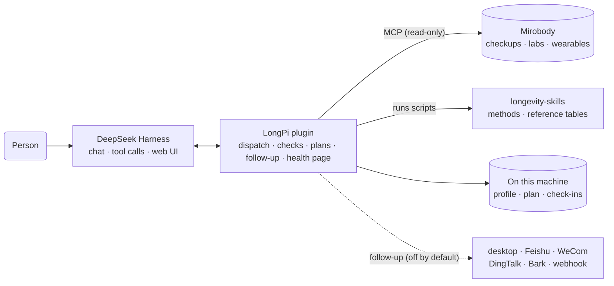

# LongPi

**English** · **[中文](README.zh.md)**

LongPi is a personal longevity assistant for [DeepSeek Harness](https://github.com/deepseek-ai/deepseek-harness). It connects checkup reports, lab results and wearable data with more than 170 aging-research methods, each reproduced from its paper. From the results a person already has, it computes biological age, 10-year cardiovascular risk and other personal measures, and marks changes across checkups that exceed the person's normal fluctuation. It drafts a lifestyle intervention plan from those results and the trial evidence, reminds the person to check in and retest once the plan is confirmed, and uses within-person biological variation to tell a real change from normal fluctuation. Every result traces back to its original paper, and every method states its limits.

- **Biological age and disease risk**: published models such as phenotypic age (Levine) and China-PAR, with a trend across every checkup, and a list of tests to add at the next checkup when inputs are missing.
- **Record changes**: changes between checkups that exceed the person's normal fluctuation are listed with the values, the size of the change and the basis for the call, and whether to take the reports to a doctor.
- **Plans, drafted and tracked**: a draft plan built from the person's results and the average effects seen in trials, with the evidence for every item; once confirmed, adherence from wearables, the medication log and check-ins. Plans never touch prescription medicines and never give a dose.
- **Proactive follow-up**: reminders to check in and retest, plus a weekly summary, by desktop notification or Feishu, WeCom, DingTalk, Bark or a generic webhook. Off by default.
- **Effect review**: reference change values separate real change from noise, next to the average effect seen in trials.
- **Evidence lookup**: what the collected papers say about drugs, supplements, diets and genes, grouped by human, animal and cell studies.

<p align="center"></p>

## Installation

In a macOS or Linux terminal, run:

```bash
curl -fsSL https://raw.githubusercontent.com/zwbao/dsh-plugin-longpi/main/install.sh | bash
```

The installer adds the DeepSeek Harness CLI if it is missing, downloads the skill library, creates a Python environment with the Mirobody terminology engine under `~/longpi`, and installs and configures the plugin in DeepSeek Harness. It needs Node.js 22.19+, Python 3.12+ and git, and running it again updates everything.

Health records come from [Mirobody](https://github.com/thetahealth/mirobody). With an existing Mirobody, add `--mcp-url` and its personal MCP address, or paste the address later in the LongPi page of the DeepSeek Harness settings and test the connection there. Without one, add `--with-mirobody` to deploy a local instance with demo data through Docker:

```bash
curl -fsSL https://raw.githubusercontent.com/zwbao/dsh-plugin-longpi/main/install.sh | bash -s -- --with-mirobody
```

See `install.sh --help` for other options and [docs/install.md](docs/install.md) for a step-by-step installation.

## Usage

Start DeepSeek Harness with `dsh web`. On first launch, enter a DeepSeek API key when asked; if there is no workspace yet, LongPi creates one named 健康对话. LongPi's onboarding then takes four steps:

1. **About and consent**: what LongPi does and where the data is kept.
2. **Profile**: age, sex, and the six facts the cardiovascular model needs (smoking, diabetes, blood-pressure medicine in the last two weeks, northern or southern China, urban or rural, early cardiovascular disease in the family). Every question can be skipped; a skipped answer means unknown, never no.
3. **Records**: the indicators found in Mirobody, and which tests the first results still need.
4. **First results**: phenotypic age and 10-year cardiovascular risk. When tests are missing, it lists what to add at the next checkup; waist and home blood pressure can be measured at home and entered directly. This step can also turn on an evening check-in reminder.

After onboarding:

- **Home**: a new chat opens with a greeting in place of the default title and one sentence on where things stand, with a second line when the record has changes beyond normal fluctuation. Under the input box sit only the next things to do: today's check-ins and the nearest retest while a plan runs, otherwise two suggested questions that go into the input box when tapped.
- **Health page**: 健康 in the sidebar opens the full page in four tabs. 概览 has today's check-ins, phenotypic age, cardiovascular risk, the next step and notable changes; 指标 lists every checkup and wearable value by group with its trend and whether it moved beyond normal fluctuation; 方案 has the plan, adherence, timeline and verdicts; 档案 has the profile, self-measurements, the data connection and export.
- **Settings**: the LongPi page in DeepSeek Harness settings holds follow-up reminders, the Mirobody connection (paste an address, test, save), privacy notes and the method library.
- **Plans**: say 帮我制定一份改善方案 in the chat, or edit the draft card on the health page or in the chat item by item and adopt it; a plan from a doctor or longevity coach can be saved too. LongPi reads the plan back first, and the person approves the save in DeepSeek Harness.
- **Tracking and review**: wearable data counts toward adherence automatically; other items are checked in from the home, the health page or the chat. Once a retest reaches Mirobody, the health page gives a verdict (working, within noise, the wrong way, or cannot tell) with its reasons.
- **Follow-up**: turn it on in the LongPi page of the settings and set the check-in, retest and weekly-summary times, quiet hours and channels. Reminders are sent only while DeepSeek Harness is running; the brief mode carries no health values.

<p align="center"></p>
<p align="center"><br><sub>Screenshots use demo data.</sub></p>

Example questions:

| Goal | Example |
| --- | --- |
| See existing results | Which indicators are in my record? |
| See real changes | Which changes across my checkups exceed normal fluctuation? |
| Biological age | Compute my phenotypic age from the blood tests in my record |
| Cardiovascular risk | What is my 10-year cardiovascular risk? |
| Draft a plan | Draft an improvement plan for me |
| Save your own plan | Save my plan: brisk walking 8,000 steps a day, strength training three times a week, asleep by 11 pm |
| Reminders | Remind me to check in at 9 pm every day |
| Review the plan | Is my plan working? Which parts cannot be judged yet? |
| Model a goal | If fasting glucose drops to 5.0, how would my phenotypic age change? |
| Look up evidence | What do the collected papers say about NMN and metformin? |

The health page, the settings page and the API all need the DeepSeek Harness login: the API accepts only the cookie a logged-in browser holds, so other programs and web pages cannot read or write it. Type `/longpi` in the chat to see the status: skill library version, Mirobody connection, onboarding stage and follow-up settings.

## How it works



Three parts work together:

- **DeepSeek Harness** hosts the conversation, tool calls and web interface; LongPi registers its tools, commands, home, health page and onboarding as a plugin.
- **Mirobody** holds the health record and maps lab names from any source to LOINC codes and units to UCUM. LongPi reads the record through its MCP endpoint, read-only, and runs the terminology engine locally.
- **[longevity-skills](https://github.com/zwbao/longevity-skills)** is the method library. Each method comes from one published paper and carries a machine-readable input manifest (LOINC codes, units, plausible ranges), a script that reproduces the paper's formula, and tests whose expected values are numbers printed in the paper. The library is updated weekly with new papers.

Key mechanisms:

- **Dispatch**: a question is matched to intents, then methods are ranked by the tests already in the record. Methods that can run now come first; the others list what they still need.
- **Input checks**: values pass as recorded. The plugin converts units declared in the manifest and checks plausible ranges, and refuses a missing or wrong unit before the script runs instead of guessing.
- **Effect review**: a change counts as real only when it exceeds the reference change value (RCV = √2 × 1.96 × √(CVA² + CVI²)), with within-person variation (CVI) taken from journal articles. Adherence, the retest interval and other changes over the same period are weighed as well.
- **Record changes**: for every checkup marker with a sourced row in the biological-variation table, the latest result is compared with the previous one and with the first; only a difference beyond the reference change value is listed. A change in the wrong direction, or on a marker whose meaning depends on the lab's reference range, comes with the advice to take the reports to a doctor; no cause is suggested and nothing is diagnosed.
- **Plan drafting**: priorities come from the sensitivities of the phenotypic-age and China-PAR models and from what the person cares about most; candidate items come only from the collected table of trial effects. Prescription drugs are always excluded, and supplements appear only as options to confirm with a doctor, never with a dose. On adoption the server rebuilds every item from its evidence id instead of saving the text the page sent.
- **Safety judgement**: for every message the person sends, the configured model judges whether it is an emergency happening now, a risk of self-harm, a request to start, stop or dose a medicine, or a question about research, and LongPi adds one note for the reply; the person's words are never replaced. When the model call fails, rules that recognise negation, family history and risk questions take over. Before a turn ends, a reply that gave a dose or advised a prescription change is sent back for a correction.
- **Proactive follow-up**: while DeepSeek Harness runs, the plugin checks every minute whether a check-in, retest or weekly summary is due, and respects quiet hours and a daily cap. When the model turns follow-up on, switches to full detail or sets a webhook from the chat, the person approves it in DeepSeek Harness.
- **Model estimates**: biological age, risk and goal estimates are computed by the method scripts and labelled as model estimates; LongPi does not predict an individual's lifespan.

**Data and privacy**: the profile, plans, check-ins and self-measurements stay on this machine in `~/.dsh/longpi`, and the health record stays in the person's own Mirobody. LongPi itself uploads nothing; only when a follow-up webhook is set does the reminder text go to the service the person configured, and the brief mode carries no health values or plan item names. DeepSeek Harness sends conversation content and tool results to the configured model provider. By default it also uploads session logs with its requests; to turn that off, add this to `~/.dsh/profiles/web/cordis.patch.yml`:

```yaml
- id: session-log-deepseek
  config:
    enabled: false
```

## Configuration

The installer writes the configuration. To change it, edit the `dsh-plugin-longpi` block in `~/.dsh/profiles/web/cordis.patch.yml`; changes apply on save. Every key is described in [docs/reference.md](docs/reference.md#configuration).

## Development

```bash
git clone https://github.com/zwbao/dsh-plugin-longpi.git && cd dsh-plugin-longpi
npm ci
npm test          # needs longevity-skills beside this checkout, or LONGEVITY_SKILLS_HOME
npm run preview   # renders the home, health page and onboarding with demo data, no DeepSeek Harness needed
```

## Documentation

- [Manual installation](docs/install.md)
- [Reference: configuration, tools, routes and review rules](docs/reference.md)
- [Architecture](docs/architecture.md)
- [Intended use](docs/intended-use.md)
- [Changelog](CHANGELOG.md)

## Disclaimer

LongPi is for personal health management and research reference. It is not a medical device and gives no diagnosis, prescription or dosing advice. All model results are estimates and do not replace professional medical advice; in an emergency, call your local emergency number (120 in China).

## License

[MIT](LICENSE). The bundled `vendor/dsh-plugin-mirobody` is Apache-2.0; for the skill library and its data, see [longevity-skills](https://github.com/zwbao/longevity-skills/blob/main/THIRD_PARTY_NOTICES.md).
