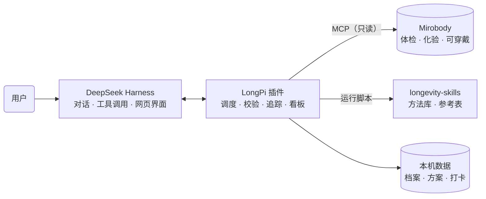

# LongPi

**[English](README.md)** · **中文**

LongPi 是运行在 [DeepSeek Harness](https://github.com/deepseek-ai/deepseek-harness) 上的个人长寿助手。它把体检报告、化验结果和可穿戴设备数据，与 170 余项经过论文复现的衰老研究方法连接起来：直接从已有检查中计算生物年龄、十年心血管病风险等个人指标；在用户制定干预方案之后持续追踪执行情况，依据个体生物变异判断每一项指标的变化是真实改善还是正常波动；并推演指标达到目标后可能带来的变化。每个结果都可以追溯到原始论文，每个方法都注明适用边界。

- **生物年龄与疾病风险**：按表型年龄（Levine）、China-PAR 等已发表模型计算，历次体检自动形成趋势。
- **干预方案追踪**：保存用户自己的方案，结合手环数据、服药记录和打卡计算执行率。
- **效果判定**：以参考变化值区分真实变化与正常波动，并与临床试验的平均效应对照。
- **证据检索**：查询收录论文中关于药物、补剂、饮食与基因的结论，按人群、动物、细胞研究分组。

## 安装

在 macOS 或 Linux 终端中运行：

```bash
curl -fsSL https://raw.githubusercontent.com/zwbao/dsh-plugin-longpi/main/install.sh | bash
```

安装脚本会安装 DeepSeek Harness 命令行（如尚未安装），下载方法库，在 `~/longpi` 下创建包含 Mirobody 术语引擎的 Python 环境，并将插件安装、配置到 DeepSeek Harness。运行前需要 Node.js 22.19 及以上、Python 3.12 及以上和 git；重复运行即可更新。

健康记录由 [Mirobody](https://github.com/thetahealth/mirobody) 提供。已有 Mirobody 时，追加 `--mcp-url` 传入其个人 MCP 地址；尚未部署时，追加 `--with-mirobody`，由脚本通过 Docker 在本机部署一个带演示数据的实例：

```bash
curl -fsSL https://raw.githubusercontent.com/zwbao/dsh-plugin-longpi/main/install.sh | bash -s -- --with-mirobody
```

其他选项见 `install.sh --help`；逐步安装说明见 [docs/install.zh.md](docs/install.zh.md)。

## 使用

运行 `dsh web` 启动 DeepSeek Harness。首次打开时按提示填写 DeepSeek API Key 并选择工作区，然后：

1. **建立档案**：填写年龄、性别，以及计算心血管病风险所需的六项情况（吸烟、糖尿病、近两周是否服用降压药、居住在南方或北方、城市或农村、早发心血管病家族史）。可以在健康看板底部的「记录、方法和档案」中填写，也可以直接在对话中告知。
2. **查看结果**：在会话顶部的视图标签中打开「健康看板」。记录中有同一天测齐的九项血检时，看板自动计算历次体检的表型年龄和十年心血管病风险。
3. **制定方案**：在对话中描述干预方案，或上传医生、长寿师提供的方案。LongPi 复述要点、经确认后保存，并在看板上显示时间线、复测日期和目标推演。
4. **追踪与复盘**：手环数据自动计入执行率，其余项目可在对话中说明或在看板上打卡。复测结果进入 Mirobody 后，看板给出「有效」「波动内」「反向」或「无法判断」的判定及依据。

常用提问示例：

| 目的 | 示例 |
| --- | --- |
| 查看已有检查 | 我的记录里有哪些检查指标？ |
| 计算生物年龄 | 用我记录里的血检算一下表型年龄 |
| 评估心血管风险 | 帮我算十年心血管病风险 |
| 保存干预方案 | 帮我保存方案：每天快走 8000 步，每周三次力量训练，11 点前睡觉 |
| 评估方案效果 | 我的方案有没有效果？哪些还看不出来？ |
| 推演目标 | 如果空腹血糖降到 5.0，表型年龄会怎样变化？ |
| 查询证据 | NMN 和二甲双胍在收录的论文里有什么结论？ |

在输入框中输入 `/longpi` 可查看运行状态，包括方法库版本、Mirobody 连接情况和档案。

## 工作原理



LongPi 由三部分协作完成：

- **DeepSeek Harness** 承载对话、工具调用和网页界面，LongPi 以插件形式向其注册工具、命令和健康看板。
- **Mirobody** 保存健康记录，并将不同来源的化验名称统一为 LOINC 编码、单位统一为 UCUM。LongPi 通过 MCP 接口只读访问记录，术语引擎在本机运行。
- **[longevity-skills](https://github.com/zwbao/longevity-skills)** 是方法库。每个方法对应一篇已发表论文，包含机器可读的输入清单（LOINC 编码、单位与合理范围）、复现论文公式的脚本，以及以论文印出数值为期望值的测试；方法库每周随新论文更新。

主要机制：

- **技能调度**：问题先匹配意图，再按记录中已有的检查对方法排序。能够直接计算的方法优先，缺少输入的方法会列出所缺项目。
- **输入校验**：数值按记录原样传入，插件依据清单换算单位并检查合理范围；单位缺失或不符时在运行前拒绝，不作推测。
- **效果判定**：两次检查的变化超过参考变化值（RCV = √2 × 1.96 × √(CVA² + CVI²)）才视为真实变化，其中个体内生物变异（CVI）取自期刊论文。判定同时考虑执行率、复测间隔以及同期的其他变化。
- **模型估计**：生物年龄、疾病风险和目标推演均由方法脚本计算，并标注为模型估计，不给出个人寿命预测。

**数据与隐私**：LongPi 不上传任何数据。档案、方案和打卡记录保存在本机 `~/.dsh/longpi`，健康记录保留在用户自己的 Mirobody 中。对话内容和工具结果由 DeepSeek Harness 发送给所配置的模型服务；DeepSeek Harness 默认还会随请求上传会话日志，如需关闭，可在 `~/.dsh/profiles/web/cordis.patch.yml` 中加入：

```yaml
- id: session-log-deepseek
  config:
    enabled: false
```

## 配置

安装脚本会自动写入配置。如需调整，编辑 `~/.dsh/profiles/web/cordis.patch.yml` 中 `dsh-plugin-longpi` 的配置块，保存后即时生效。全部配置项见 [docs/reference.zh.md](docs/reference.zh.md#配置)。

## 开发

```bash
git clone https://github.com/zwbao/dsh-plugin-longpi.git && cd dsh-plugin-longpi
npm ci
npm test          # 需要同级目录中的 longevity-skills，或设置 LONGEVITY_SKILLS_HOME
npm run preview   # 以演示数据渲染健康看板，无需 DeepSeek Harness
```

## 文档

- [手动安装](docs/install.zh.md)
- [参考：配置、工具、接口与评估规则](docs/reference.zh.md)
- [架构](docs/architecture.md)
- [适用范围](docs/intended-use.md)
- [更新记录](CHANGELOG.md)

## 免责声明

LongPi 用于个人健康管理与研究参考，不是医疗器械，不提供诊断、处方或用药剂量建议。所有模型结果均为估计值，不能替代专业医疗意见；遇到紧急情况请立即拨打 120。

## 许可

[MIT](LICENSE)。随附的 `vendor/dsh-plugin-mirobody` 采用 Apache-2.0；方法库及其数据的许可见 [longevity-skills](https://github.com/zwbao/longevity-skills/blob/main/THIRD_PARTY_NOTICES.md)。
