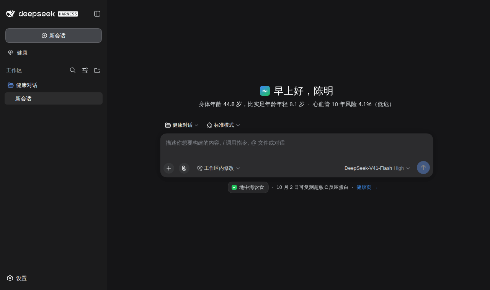
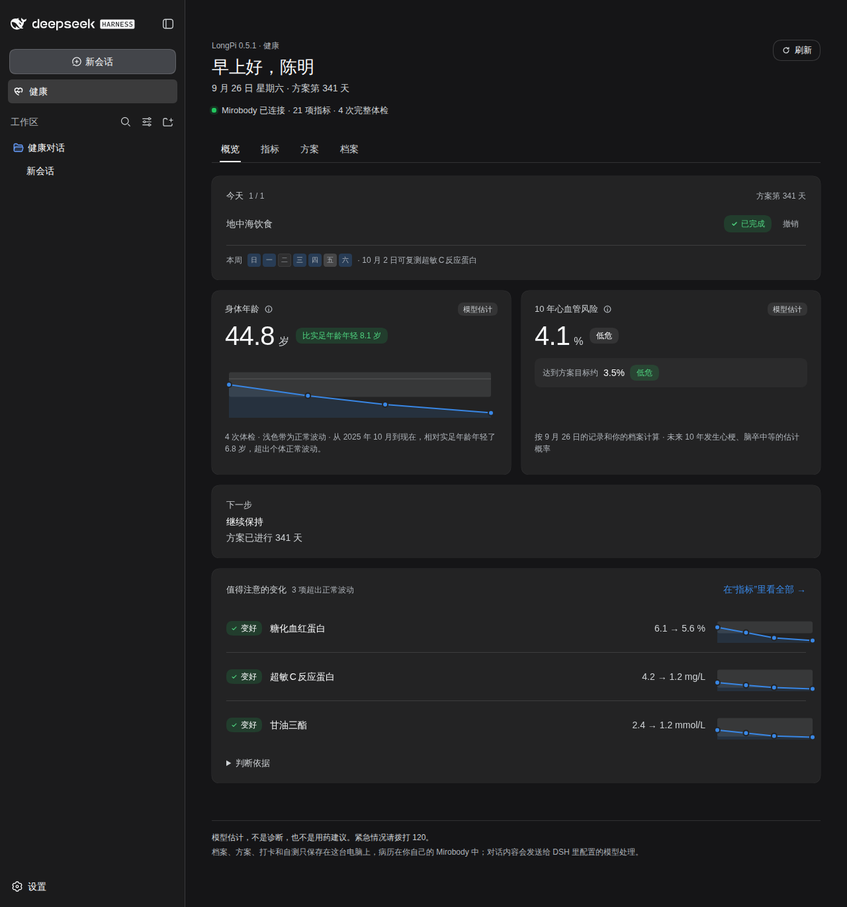
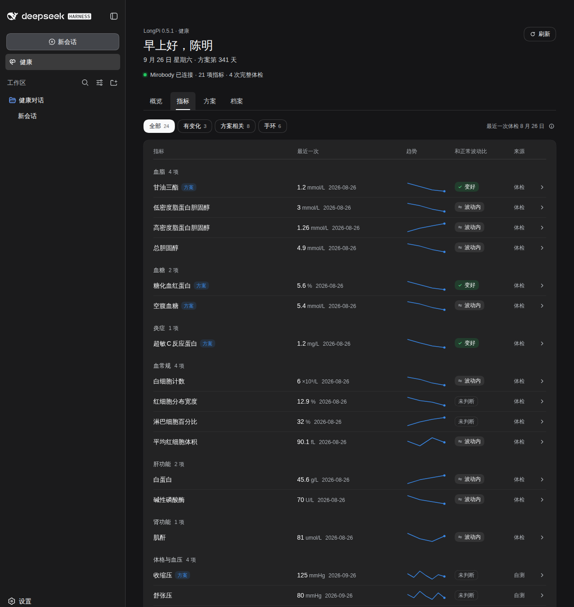
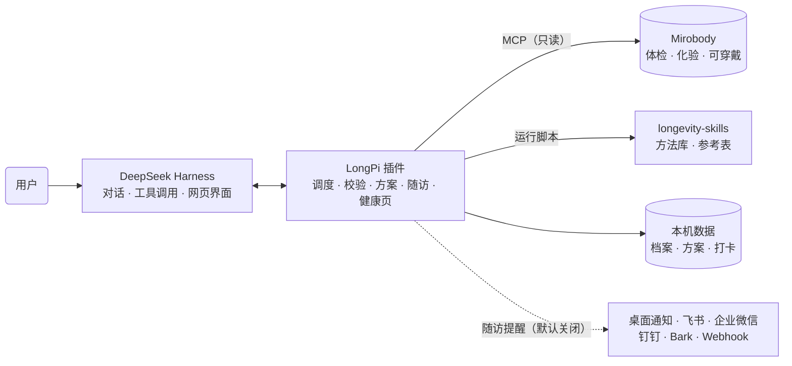

# LongPi

**[English](README.md)** · **中文**

LongPi 是运行在 [DeepSeek Harness](https://github.com/deepseek-ai/deepseek-harness) 上的个人长寿助手。它把体检报告、化验结果和可穿戴设备数据，与 170 余项经过论文复现的衰老研究方法连接起来：直接从已有检查中计算生物年龄、十年心血管病风险等个人指标，标出历次体检中超出个人正常波动的变化；依据个人结果和临床试验证据起草生活方式干预方案，确认后按时提醒打卡与复测，并依据个体生物变异判断每一项指标的变化是真实改善还是正常波动。每个结果都可以追溯到原始论文，每个方法都注明适用边界。

- **生物年龄与疾病风险**：按表型年龄（Levine）、China-PAR 等已发表模型计算，历次体检自动形成趋势；缺少检查时给出下次体检的加测清单。
- **记录变化提醒**：历次体检中超出个人正常波动的变化会被单独列出，写明数值、幅度与判断依据，并提示是否需要带着报告咨询医生。
- **起草与追踪方案**：依据个人结果与收录的试验平均效应起草方案，逐项注明证据；确认后保存，结合手环数据、服药记录和打卡计算执行率。方案不涉及处方药，也不给出任何剂量。
- **安全判断**：涉及健康的每条消息先由所配置的模型判断是否属于正在发生的急症、自伤风险、要求开药停药或给自己剂量，LongPi 据此附加一条提示，用户的原话不会被替换；回复若给出剂量或建议调整处方药，会在本轮结束前更正。
- **主动随访**：按设定时间通过桌面通知或飞书、企业微信、钉钉、Bark、通用 Webhook 提醒打卡与复测，并发送每周小结；默认关闭。
- **效果判定**：以参考变化值区分真实变化与正常波动，并与临床试验的平均效应对照。
- **证据检索**：查询收录论文中关于药物、补剂、饮食与基因的结论，按人群、动物、细胞研究分组。

<p align="center"></p>

## 安装

在 macOS 或 Linux 终端中运行：

```bash
curl -fsSL https://raw.githubusercontent.com/zwbao/dsh-plugin-longpi/main/install.sh | bash
```

安装脚本会安装 DeepSeek Harness 命令行（如尚未安装），下载方法库，在 `~/longpi` 下创建包含 Mirobody 术语引擎的 Python 环境，并将插件安装、配置到 DeepSeek Harness。运行前需要 Node.js 22.19 及以上、Python 3.12 及以上和 git；重复运行即可更新。

健康记录由 [Mirobody](https://github.com/thetahealth/mirobody) 提供。已有 Mirobody 时，追加 `--mcp-url` 传入其个人 MCP 地址，也可以安装后在 DeepSeek Harness 设置的「LongPi」页中粘贴地址并测试连接；尚未部署时，追加 `--with-mirobody`，由脚本通过 Docker 在本机部署一个带演示数据的实例：

```bash
curl -fsSL https://raw.githubusercontent.com/zwbao/dsh-plugin-longpi/main/install.sh | bash -s -- --with-mirobody
```

其他选项见 `install.sh --help`；逐步安装说明见 [docs/install.zh.md](docs/install.zh.md)。

## 使用

运行 `dsh web` 启动 DeepSeek Harness。首次打开时先按提示填写 DeepSeek API Key；如果还没有任何工作区，LongPi 会创建一个名为「健康对话」的工作区。随后 LongPi 的引导分四步完成建档：

1. **了解与同意**：说明 LongPi 能做什么、数据保存在哪里。
2. **建立档案**：年龄、性别，以及计算心血管病风险所需的六项情况（吸烟、糖尿病、近两周是否服用降压药、居住在南方或北方、城市或农村、早发心血管病家族史）。每一项都可以跳过，跳过视为「不知道」，不会当作「否」。
3. **连接记录**：显示 Mirobody 中的指标，以及算出第一个结果还缺哪些检查。
4. **第一个结果**：显示身体年龄和十年心血管病风险。缺少检查时列出下次体检的加测清单，腰围和家庭血压可以自己测量后直接记录。这一步也可以开启每晚的打卡提醒。

完成建档后：

- **首页**：新对话的首页以问候语代替默认标题，下面用一句话概括当前进展；记录中有超出正常波动的变化时另起一行提示。输入框下方只保留当前最该做的事：执行方案期间是今天的打卡和最近的复测，其他阶段是两个建议的问题，点击后放入输入框。
- **健康页**：侧栏的「健康」打开完整页面，分为四个标签：「概览」是今天的打卡、身体年龄、心血管风险、下一步和值得注意的变化；「指标」按类别列出记录里的每一项检查和手环数据，附趋势和是否超出正常波动；「方案」是方案、执行率、时间线和各项判定；「档案」是档案、自测记录、数据连接与导出。
- **对话时**：DeepSeek Harness 右侧栏的「健康」标签在对话旁显示今天的打卡、两项结果和值得注意的变化。一轮对话起草了方案、复述了方案或记下了打卡时，这一轮下方会有一行快捷操作，与卡片上的相同（采用、确认、撤销），因为 DeepSeek Harness 会把结束的一轮里的工具调用折叠起来。
- **设置**：DeepSeek Harness 设置中的「LongPi」页包含随访提醒、Mirobody 连接（粘贴地址、测试、保存）、隐私说明和方法库。
- **制定方案**：在对话中说「帮我制定一份改善方案」，或在健康页、对话中的方案草稿卡片上逐项删改后采用；也可以保存医生或长寿师提供的方案。LongPi 先复述要点，保存时由用户在 DeepSeek Harness 中确认。
- **追踪与复盘**：手环数据自动计入执行率，其余项目可在首页、健康页或对话中打卡。复测结果进入 Mirobody 后，健康页给出「有效」「波动内」「反向」或「无法判断」的判定及依据。
- **随访提醒**：在设置的「LongPi」页中开启，设置打卡、复测和每周小结的时间、免打扰时段和发送渠道。提醒只在 DeepSeek Harness 运行时发送；「简要」模式不含任何健康数值。

<p align="center"></p>
<p align="center"><br><sub>截图使用演示数据。</sub></p>

常用提问示例：

| 目的 | 示例 |
| --- | --- |
| 查看已有检查 | 我的记录里有哪些检查指标？ |
| 查看明显变化 | 我历次体检里有哪些变化超出了正常波动？ |
| 计算生物年龄 | 用我记录里的血检算一下表型年龄 |
| 评估心血管风险 | 帮我算十年心血管病风险 |
| 起草方案 | 帮我制定一份改善方案 |
| 保存自己的方案 | 帮我保存方案：每天快走 8000 步，每周三次力量训练，11 点前睡觉 |
| 设置提醒 | 每天晚上 9 点提醒我打卡 |
| 评估方案效果 | 我的方案有没有效果？哪些还看不出来？ |
| 推演目标 | 如果空腹血糖降到 5.0，表型年龄会怎样变化？ |
| 查询证据 | NMN 和二甲双胍在收录的论文里有什么结论？ |

健康页、设置页和接口都需要 DeepSeek Harness 的登录：接口只接受浏览器登录后的 Cookie，本机其他程序和网页无法直接读写。在输入框中输入 `/longpi` 可查看运行状态，包括方法库版本、Mirobody 连接情况、建档阶段和随访设置。

## 工作原理



LongPi 由三部分协作完成：

- **DeepSeek Harness** 承载对话、工具调用和网页界面，LongPi 以插件形式向其注册工具、命令、首页、健康页与引导。
- **Mirobody** 保存健康记录，并将不同来源的化验名称统一为 LOINC 编码、单位统一为 UCUM。LongPi 通过 MCP 接口只读访问记录，术语引擎在本机运行。
- **[longevity-skills](https://github.com/zwbao/longevity-skills)** 是方法库。每个方法对应一篇已发表论文，包含机器可读的输入清单（LOINC 编码、单位与合理范围）、复现论文公式的脚本，以及以论文印出数值为期望值的测试；方法库每周随新论文更新。

主要机制：

- **技能调度**：问题先匹配意图，再按记录中已有的检查对方法排序。能够直接计算的方法优先，缺少输入的方法会列出所缺项目。
- **输入校验**：数值按记录原样传入，插件依据清单换算单位并检查合理范围；单位缺失或不符时在运行前拒绝，不作推测。
- **效果判定**：两次检查的变化超过参考变化值（RCV = √2 × 1.96 × √(CVA² + CVI²)）才视为真实变化，其中个体内生物变异（CVI）取自期刊论文。判定同时考虑执行率、复测间隔以及同期的其他变化。
- **记录变化**：对每一项在生物变异表中有出处的体检指标，比较最近一次与上一次、与最早一次的结果；超过参考变化值才列为明显变化。变差的方向、以及需要结合参考范围判断的指标会建议带着报告咨询医生，不推测原因，也不作诊断。
- **方案起草**：优先级来自表型年龄与 China-PAR 模型对各指标的敏感度和用户最关心的方面；候选措施只取自收录的试验效应表，处方药一律排除，补剂只作为「需先与医生确认」的选项且不含剂量。采用时服务端按证据编号重建每一项，不保存客户端传来的文字。
- **安全判断**：在 LongPi 工作区（健康对话）里，用户每发一条消息都由所配置的模型判断；在其他工作区，只判断涉及健康的消息以及此后该对话的其余消息，其他对话不增加模型调用和等待（`guardScope: all` 则所有消息都判断）。模型判断它是否属于正在发生的急症、自伤风险、要求开药停药或给自己剂量，或是询问研究结论，并据此给回复附加一条提示；用户的原话不会被替换。模型调用失败时，或不在上述范围内时，由能识别否定、家族史和风险提问的规则判断。每轮回复结束前再检查一次，若给出了剂量或建议调整处方药，会要求模型更正。
- **主动随访**：DeepSeek Harness 运行期间，插件每分钟判断是否到了打卡、复测或每周小结的时间，遵守免打扰时段和每日上限；在对话中由模型开启随访、改为「详细」模式或设置 Webhook 时，需要用户在 DeepSeek Harness 中确认。
- **模型估计**：生物年龄、疾病风险和目标推演均由方法脚本计算，并标注为模型估计，不给出个人寿命预测。

**数据与隐私**：档案、方案、打卡和自测记录保存在本机 `~/.dsh/longpi`，健康记录保留在用户自己的 Mirobody 中。LongPi 本身不上传数据；只有开启随访提醒的 Webhook 渠道后，提醒内容才会发送到用户配置的服务，「简要」模式不含健康数值和方案项目名称。对话内容和工具结果由 DeepSeek Harness 发送给所配置的模型服务；DeepSeek Harness 默认还会随请求上传会话日志，如需关闭，可在 `~/.dsh/profiles/web/cordis.patch.yml` 中加入：

```yaml
- id: session-log-deepseek
  config:
    enabled: false
```

## 配置

安装脚本会自动写入配置。如需调整，编辑 `~/.dsh/profiles/web/cordis.patch.yml` 中 `dsh-plugin-longpi` 的配置块，保存后即时生效。全部配置项见 [docs/reference.zh.md](docs/reference.zh.md#配置)。

## 开发

```bash
git clone https://github.com/zwbao/dsh-plugin-longpi.git && cd dsh-plugin-longpi
npm ci
npm test          # 需要同级目录中的 longevity-skills，或设置 LONGEVITY_SKILLS_HOME
npm run preview   # 以演示数据渲染首页、健康页与引导，无需 DeepSeek Harness
```

## 文档

- [手动安装](docs/install.zh.md)
- [参考：配置、工具、接口与评估规则](docs/reference.zh.md)
- [架构](docs/architecture.md)
- [适用范围](docs/intended-use.md)
- [更新记录](CHANGELOG.md)

## 免责声明

LongPi 用于个人健康管理与研究参考，不是医疗器械，不提供诊断、处方或用药剂量建议。所有模型结果均为估计值，不能替代专业医疗意见；遇到紧急情况请立即拨打 120。

## 许可

[MIT](LICENSE)。随附的 `vendor/dsh-plugin-mirobody` 采用 Apache-2.0；方法库及其数据的许可见 [longevity-skills](https://github.com/zwbao/longevity-skills/blob/main/THIRD_PARTY_NOTICES.md)。
